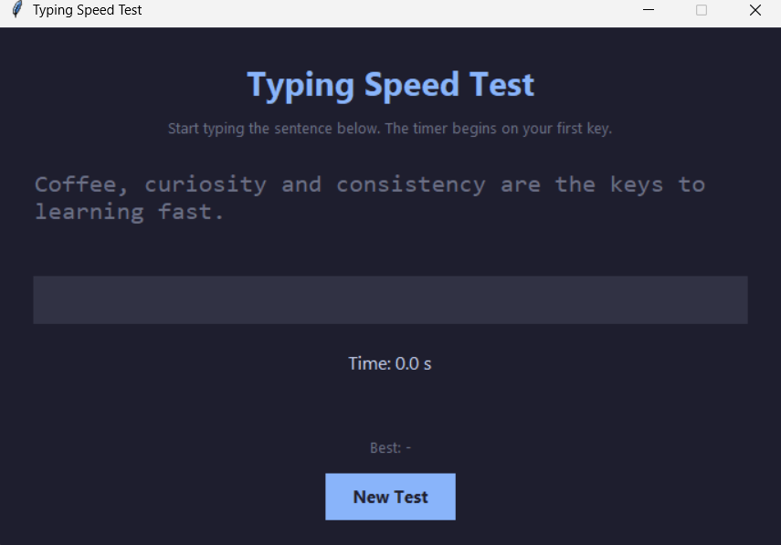

# Typing Speed Test

A simple Python GUI application that measures typing speed and accuracy using Tkinter.

## Features

- Random typing sentences
- Live typing feedback
- Correct characters shown in green
- Incorrect characters shown in red
- Automatic timer
- Words Per Minute (WPM) calculation
- Typing accuracy calculation
- Performance rating
- Best WPM score during the session
- New Test button for another attempt

## Technologies Used

- Python
- Tkinter
- Strings
- Functions
- Object-Oriented Programming

## How to Run

Make sure Python is installed on your computer.

## Screenshots

### Application Interface



Run the following command:

```bash
python typing_speed_test.py
